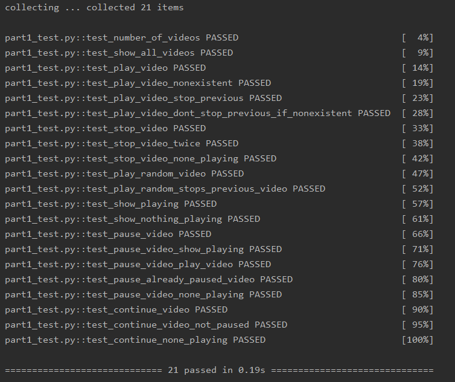
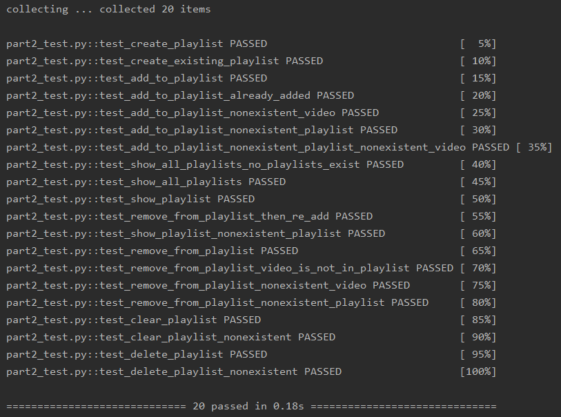
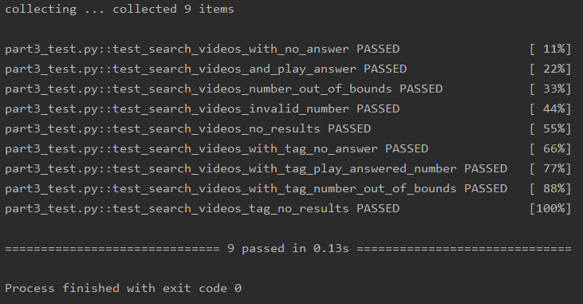
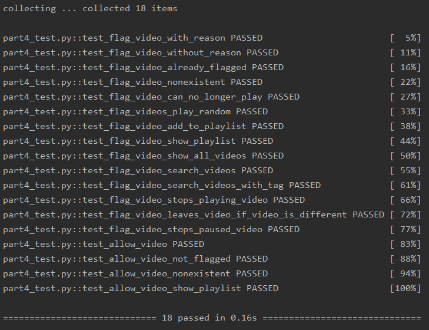

<h1 align="center">
  
  
   
  2021 Bright Network Internship
   
  Google Youtube Coding Challenge
   
  Challenge Completed!
</h1>

Written by [Zach CHAN](https://zachan.dev/)
(Links: [Website](https://zachan.dev/)
[LinkedIn](https://www.linkedin.com/in/zach-chan-hk/)
[Email](mailto:zach@zachan.dev))

Participant ID: [shc39@student.london.ac.uk](mailto:zach@zachan.dev)

## Table of Contents

<!-- toc -->

- [Coding Challenge Introduction](#coding-challenge-introduction)
- [Programming Language Chosen](#programming-language-chosen)
- [Passed Tests Screenshot](#passed-tests-screenshot)
  - [Part 1](#part-1)
  - [Part 2](#part-2)
  - [Part 3](#part-3)
  - [Part 4](#part-4)

<!-- tocstop -->

 

# Coding Challenge Introduction
It is my honour to become part of the Bright Network Internship, July 2021. I have chosen to take part in Google’s Coding Challenge for Bright Network. And this is my repository for submission!

# Programming Language Chosen
Python, I used [PyCharm](https://www.jetbrains.com/pycharm/) for easier coding and debugging.

[Click to see the Python coding](./python/)

# Passed Tests Screenshot
## Part 1

## Part 2

## Part 3

## Part 4
