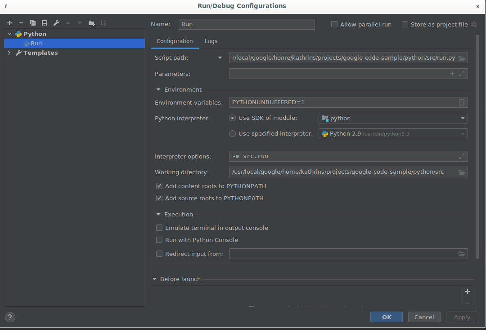
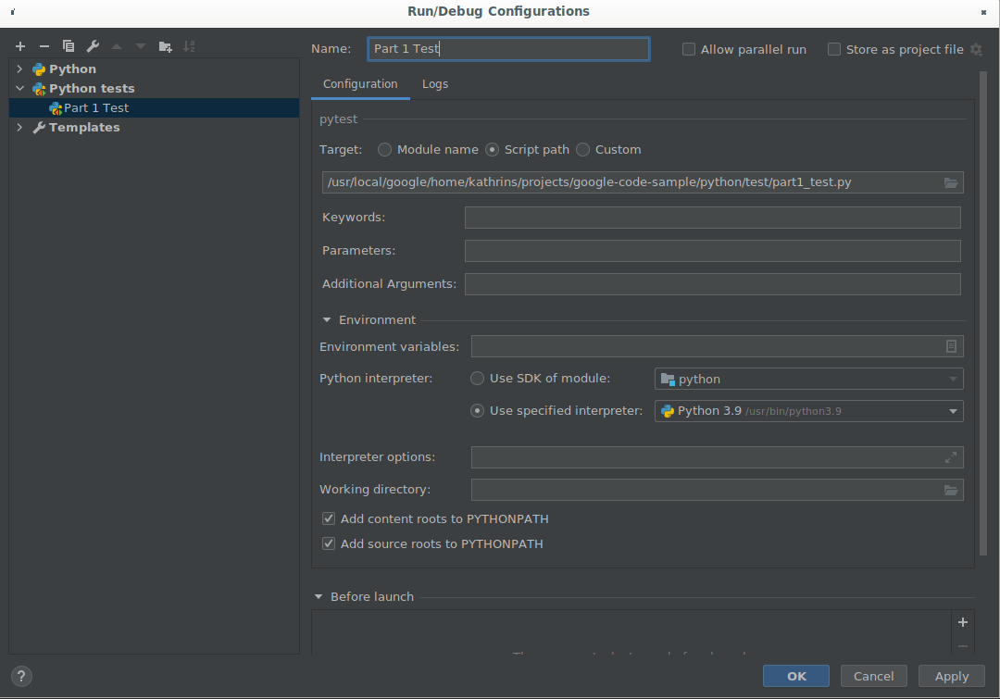

# Youtube Challenge - Python
The Python Youtube Challenge uses Python3. 
The below commands use Python3 specifically, to account for users that might 
have Python2 installed alongside Python3.

## Setting up
You can write code in any editor you'd like. However, different editors have 
different ways of dealing with Python code, so in case of doubt we recommend 
you run the code and tests from the command line as shown  below.

## Running and testing from the Commandline
To run:
```shell script
python3 -m src.run
```

#### Running the tests
The tests are using pytest, if you don't have pytest installed yet, you can do so by running:
```shell script
python3 -m pip install pytest
```

To run all the tests:
```shell script
python3 -m pytest
```
For more verbose test output you can use
```shell script
python3 -m pytest -v
```

```shell script
python3 -m pytest test/part1_test.py
python3 -m pytest test/part2_test.py
python3 -m pytest test/part3_test.py
python3 -m pytest test/part4_test.py
```

For more information on pytest commandline options, such as only running a specific test,
you can read more [here](https://docs.pytest.org/en/reorganize-docs/new-docs/user/commandlineuseful.html).

## Running and testing from IntelliJ/PyCharm
* Mark both the `python/` and `src/` directory as Sources Root
    * (Right-click on src/ > Mark Directory As > Sources Root )
* Mark the  `test/` directory as Test Sources Root
    * (Right-click on test/ > Mark Directory As > Test Sources Root)

This will allow your editor to correctly index the project.

To run the Application, follow the setup below:


To run the tests, add a pytest configuration as follows:
* Run > Edit Configurations > "+" Button > Python tests > pytest



Then you will be able to run and debug the unit tests.

